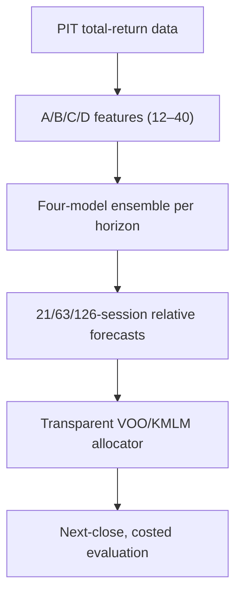

# QRE Two-Asset v12.0.0

QRE Two-Asset is a clean VOO/KMLM research and live-inference engine. Its single
primary objective is to determine whether a frozen, implementable dynamic allocation
compounds faster than buy-and-hold VOO out of sample.

## Current result status

**Strategy alpha is NOT TESTED in this distribution.** The available prior QRE archives
contained no defensible continuous VOO/KMLM total-return dataset. This package therefore
ships data contracts and a complete evaluator, not invented returns or a performance
claim. Synthetic data are used only by tests of software mechanics.

The engine permits an alpha claim only after all of the following happen:

1. approved total-return histories and explicit provenance are supplied;
2. pre-holdout nested walk-forward development freezes one candidate;
3. the final KMLM live-ETF holdout is evaluated exactly once;
4. CAGR and terminal wealth both exceed VOO after costs;
5. the frozen persistence, multiple-testing, and provenance gates pass.

If any gate fails, the deployable live engine fails closed to **100% VOO / 0% KMLM**.
Better drawdown or Sharpe statistics never override a failed CAGR objective.

## Architecture



- Investable assets: exactly VOO and KMLM.
- Target: future `log(VOO return) - log(KMLM return)` after the execution lag.
- Models per horizon: Ridge and shallow histogram gradient boosting regressors;
  logistic and shallow histogram gradient boosting classifiers.
- Ensemble: equal weights, with chronological probability calibration.
- Features: 12 VOO-only, then 11 KMLM, then 12 relative, then five optional
  point-in-time risk features (40 maximum).
- Allocator candidates: continuous, bucketed, or probability mapped; daily or weekly;
  minimum-change thresholds suppress small trades.
- Execution: information through close `t`, trade no earlier than close `t+1`, earn
  returns beginning after that execution.

See [architecture.md](docs/architecture.md) and [methodology.md](docs/methodology.md).

## Install and test

Python 3.11 or newer is required.

```bash
python -m venv .venv
. .venv/bin/activate
python -m pip install -e .
python -m unittest discover -s tests -v
```

The full synthetic workflow is opt-in because it fits many models:

```bash
QRE_RUN_INTEGRATION=1 python -m unittest tests.test_pipeline_integration -v
```

That integration test deliberately uses prohibited-for-claims synthetic history and
asserts that deployment fails closed.

## Supply research data

```bash
cp data/market_levels.template.csv data/market_levels.csv
cp data/provenance.template.yaml data/provenance.yaml
```

Replace template rows with licensed or otherwise authorized, continuous daily
total-return levels. Do not append downloaded adjusted-close series without auditing
distributions, index methodology, fees, inception boundaries, and continuity. If using
optional VIX, HY OAS, and NFCI features, also provide the long-form release/vintage file
described in [data_contract.md](docs/data_contract.md) and set `macro_data` in the config.

Validate before any research run:

```bash
qre2 --config config/research.yaml inspect-data
```

## Frozen workflow

Run pre-holdout development. This command does not compute holdout features, labels,
forecasts, or metrics:

```bash
qre2 --config config/research.yaml develop
qre2 --config config/research.yaml status
```

Review the development report, data hashes, experiment ledger, ablations, calibration,
robustness tables, and frozen manifest. When—and only when—the architecture is truly
frozen, consume the final holdout once:

```bash
qre2 --config config/research.yaml evaluate-holdout \
  --acknowledgement I_UNDERSTAND_THIS_USES_THE_FINAL_HOLDOUT
```

The command creates `artifacts/FINAL_HOLDOUT_USED.json` before any holdout forecast or
performance calculation. Even a failed evaluation consumes the holdout. Copying or
deleting the marker to peek again invalidates the protocol; it is not a supported reset.

## Daily inference

After a completed final evaluation:

```bash
qre2 --config config/research.yaml live
```

Outputs include:

- `outputs/live/latest_allocation.json`
- `outputs/live/latest_allocation.csv`
- `outputs/live/latest_report.md`
- `outputs/live/allocation_history.csv`

The report contains VOO/KMLM weights summing to 100%, horizon forecasts, calibrated
VOO-win probability, an 80% relative-return prediction interval, directional confidence,
and mechanically computed median-perturbation feature contributions. No LLM-generated
market narrative is used.

## Evidence artifacts

Development and holdout runs write CSV, JSON, Markdown, joblib, and SQLite artifacts.
They include model parameters, fold dates, calibration reliability curves, A/B/C/D
ablations, feature stability/redundancy, rolling 3/5/10-year excess, static benchmarks,
false-signal analysis, regime contribution, implementation and horizon-weight stresses,
transaction costs, executed weights, and a multiple-testing ledger.

## Important limitations

- Long pre-2020 KMLM economics require an official KFA/MLM index history or a clearly
  labeled proxy. They are not live KMLM ETF returns.
- VOO began in 2010; earlier history requires a documented S&P 500 total-return series.
- A positive historical result would be evidence, not a guarantee and not personalized
  investment advice.
- Joblib files can execute code when loaded. Use only artifacts created by this project
  in a trusted environment.

See [holdout_protocol.md](docs/holdout_protocol.md),
[leakage_audit.md](docs/leakage_audit.md), and
[research_basis.md](docs/research_basis.md).
