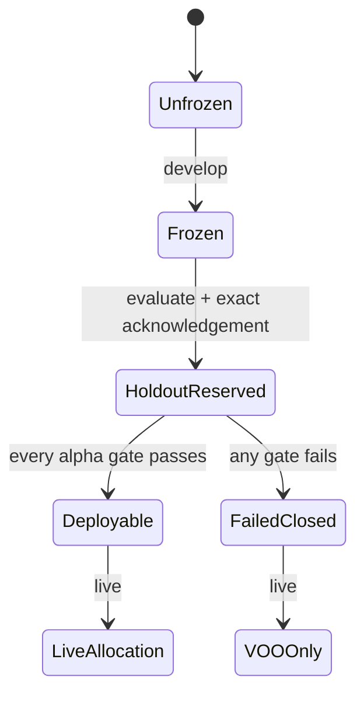

# Architecture

## Design decision

The rebuilt engine is a relative-return forecaster and allocator, not a recession model.
Its state space is deliberately small: two assets, four cumulative feature variants,
three forecast horizons, four model families per horizon, one equal-weight ensemble,
and a transparent allocator grid.

## Components

| Module | Responsibility | Excluded responsibility |
|---|---|---|
| `data.py` | Total-return levels, provenance, fee drag, PIT vintage replay | Fetching or silently repairing provider data |
| `features.py` | Backward-looking VOO, KMLM, relative, and optional risk features | Regime labels or hundreds of indicators |
| `targets.py` | Decision-aligned 21/63/126-session forward returns | Same-close execution assumptions |
| `splitters.py` | Expanding outer folds and purged prequential inner folds | Random splitting |
| `models.py` | Four compact models, calibration, horizon aggregation | Deep learning or optimized ensemble weights |
| `portfolio.py` | Allocation, turnover, costs, metrics, benchmarks | Mean-variance optimization or other assets |
| `statistics.py` | Circular block bootstrap and Reality Check | Treating naive best-backtest statistics as proof |
| `analysis.py` | False signals, regimes, gates, implementation stresses | Selecting on the final holdout |
| `pipeline.py` | Freeze, single-use holdout, live fail-close, artifacts | Re-tuning after holdout inspection |

## Information sequence

For a signal stamped `t`:

1. only observations released and visible by close `t` are eligible;
2. features use levels through close `t`;
3. the signal is calculated after close `t`;
4. assumed execution is close `t+1`;
5. the first earned return is close `t+1` to close `t+2`;
6. an `h`-session label ends at close `t+1+h`.

Training rows are purged whenever their label end date reaches or crosses the next test
boundary. This is stricter and more auditable than subtracting a fixed embargo by row
count.

## Feature variants

| Variant | Inputs | Count | Purpose |
|---|---|---:|---|
| A | VOO price behavior | 12 | Establish whether equity-only timing adds value |
| B | A + KMLM behavior | 23 | Test whether the alternative asset's own state helps |
| C | B + VOO/KMLM relative state | 35 | Test the directly decision-relevant relationship |
| D | C + PIT VIX/HY OAS/NFCI transforms | 40 | Test small incremental macro/risk value |

Variant D is skipped if all required point-in-time series do not meet the coverage gate.
There is no partial macro fallback and no current-vintage substitution.

## Model ensemble

Each horizon fits exactly:

1. Ridge regression for expected relative log return;
2. shallow histogram gradient boosting regression;
3. logistic regression for `P(VOO outperforms KMLM)`;
4. shallow histogram gradient boosting classification.

Every preprocessing step is inside the model pipeline. Linear models use median
imputation and standardization learned only from training rows. Tree models use median
imputation. Inner chronological folds select tiny hyperparameter grids. Regressor and
classifier pairs are averaged equally. The classifier ensemble is Platt-calibrated from
prequential predictions; calibration metrics are evaluated on a later chronological tail.

The three horizons are combined with frozen weights. Expected returns are normalized to
a 63-session equivalent. Disagreement and residual scale shrink the allocation score;
they do not introduce a separate optimizer.

## Allocator

The allocator maps a bounded score to a VOO target and assigns the remainder to KMLM.
Candidates vary only method, cadence, and minimum-change threshold. All weights are long
only, bounded in `[0,1]`, and sum to one. The default starting state is 100% VOO, which is
also the safe deployment fallback.

Candidate selection maximizes pre-holdout CAGR. Any candidate within 25 annual basis
points of the best is treated as economically tied; the lowest-turnover candidate wins,
with deterministic simplicity tie-breaks. Sharpe is never the selection objective.

## State and artifact flow

The frozen bundle contains the pre-holdout data hash, provenance hash, configuration
digest, feature version, chosen variant, allocator, and models. The final marker is written
before calculating holdout forecasts. The deployment bundle contains either refit models
under the frozen architecture or an explicit fail-close reason.
